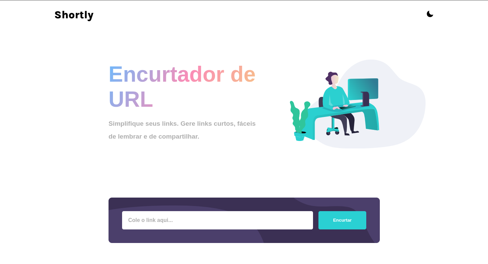

# Shortly: Encurtador de URLs 

## Principais Funcionalidades:

  - Encurtamento de URL Simplificado: Basta colar o link original no campo designado e, com um clique no botão "Encurtar", o sistema utiliza a API pública do TinyURL para gerar um link curto instantaneamente.
  - Lista de URLs Encurtadas: Todas as URLs encurtadas durante a sessão são exibidas em uma lista organizada abaixo do campo de entrada, mostrando o link original (implícito) e o novo link curto.
  - Cópia Rápida: Cada item na lista de URLs encurtadas possui um botão "Copiar", permitindo que o usuário copie o link curto para a área de transferência com um único clique, facilitando o uso imediato.
  - Tema Claro e Escuro (Dark Mode): Pensando no conforto visual do usuário, o "Shortly" inclui um botão de alternância para um tema escuro, adaptando a interface para diferentes preferências e ambientes de iluminação.
  - Validação e Feedback: A aplicação fornece feedback visual, como mensagens de erro caso o campo de URL esteja vazio, e um estado de "carregando" durante o processo de encurtamento, melhorando a experiência do usuário.
  - Atualização Fácil: Um clique no título "Shortly" recarrega a página, permitindo reiniciar o processo de forma simples.
    
## Tecnologias Utilizadas:

  - React: Biblioteca JavaScript para construção da interface de usuário componentizada.
  - Hooks do React (useState): Para gerenciamento de estado local dos componentes (valor do input, lista de URLs, estado de dark mode, erro, loading).
  - Axios: Para realizar requisições HTTP à API do TinyURL.
  - React Icons: Para ícones modernos e intuitivos (sol/lua para o tema).
  - SCSS/SASS: Empregado como pré-processador CSS, permitindo uma escrita de estilos mais organizada, modular e com funcionalidades avançadas (como variáveis, aninhamento, mixins). O código SCSS/SASS é compilado para CSS padrão, garantindo uma aparência agradável e responsiva de forma mais eficiente e manutenível.
    
O "Shortly" é um exemplo prático de como construir uma ferramenta útil e com boa usabilidade utilizando tecnologias web modernas, focando na simplicidade e eficiência para o usuário final.
